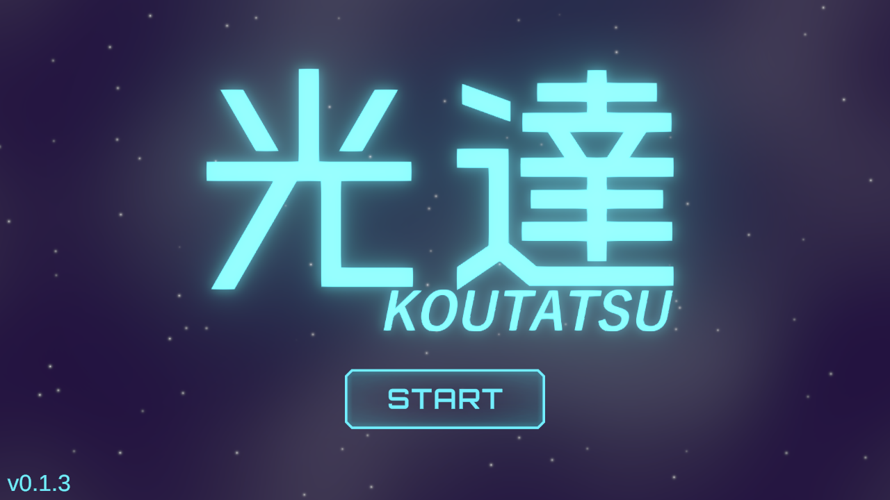

# ゲーム説明
時は20XX年――  
航行中の事故により、宇宙船は深宇宙で遭難してしまう。  
頼みの綱である電波無線通信は、強力な磁気嵐の影響で完全に沈黙――  

そんな絶望的な状況の中、あなたは一つの古典的な手段を思い出す。  
「光無線通信」―― レーザー光を使い、遠く離れた救助船へ信号を届ける方法だ。

だが、宇宙空間には障害物や死角が多く、  
レーザー光を一直線に届けることはできない。  
そこで、宇宙船に搭載されていた「鏡面衛星」を活用し、  
複数の鏡を宇宙空間に展開して、  
レーザー光を反射させながら通信経路を構築することを決意する。

限られた数の鏡と、複雑な宇宙の地形。  
あなたの知恵と工夫で、救難信号を無事に届けることができるか――？

# あそびかた
  

### 操作方法
- マウス左クリック　　　: 鏡の設置位置を決定
  - 再度クリック　　　　: 設置方向を決定
  - 設置中に右クリック　: 設置キャンセル

- レーザーの経路が救助船に届くように鏡を配置しましょう。
  - 鏡の設置後、有効な経路が存在すればレーザーが**自動的に発射**されます。
- 鏡は最大5枚まで設置できます。
- すべての鏡を使い切ってもレーザーが届かなければ失敗です。リトライボタンで再挑戦できます。
  - 成功or失敗後は、マウスポインタに追従する検証レーザーで確認できます。次に役立てよう!!
- 成功時に★難易度上昇、失敗時に☆難易度低下します。

# 推しポイント
## 光線到達パスの探査アルゴリズム
地点A->Bへ、鏡の反射を繰り返して到達する任意のパスを探査する。  
制作期間の6割をこれに費やした。
[ソースコード](./Assets/Scripts/LightPathfinder.cs)

1. 鏡像を作る
  - 到達点を鏡の直線で反転させた位置に、鏡像を考える。
  - 鏡像をさらに別の鏡で反転させた鏡像... と連鎖的に生成していく。
2. 双方向探索
  - 光源から到達点(の鏡像)に至る経路を探索。
  - 実際には、光源、到達点の両方からツリーを拡張(双方向探索)で最適化。
  - 二つのツリーの葉同士の接続ペアを総当たり
3. 経路の検証
  - 光源から鏡像への直線を考え、これを反転前の座標系に直す。
  - 鏡の線分を通っているか確認
  - Raycastで障害物にぶつからないか確認

パフォーマンス, 主にGCallocの面で様々な最適化を行っている。

## ShaderGraphによる演出
- レーザービーム
- 背景(またたく星,星雲の流れるもや)
- 設置予定ホログラフィック
- オブジェクトの影
などなど。\\\ShaderGraph完全に理解した//

# 使用アセット (.gitignore)
### Asset Store
- Blue Sci-fi GUI Kit + 250 icons! (https://assetstore.unity.com/packages/2d/gui/blue-sci-fi-gui-kit-250-icons-297446)
### 外部
- Free Icon Pack for Unity & Unreal – 1500+ Input Icons for Game UI (https://juliocacko.itch.io/free-input-prompts)  
  - Assets/Free Icon Pack for Unity & Unreal – 1500+ Input Icons for Game UI/Keyboard_Mouse etc...
- その他、一部画像素材に生成AIを利用

# 使用フォント
- マキナス4 (タイトルロゴ)
- しねきゃぷしょん2.26 (字幕)

